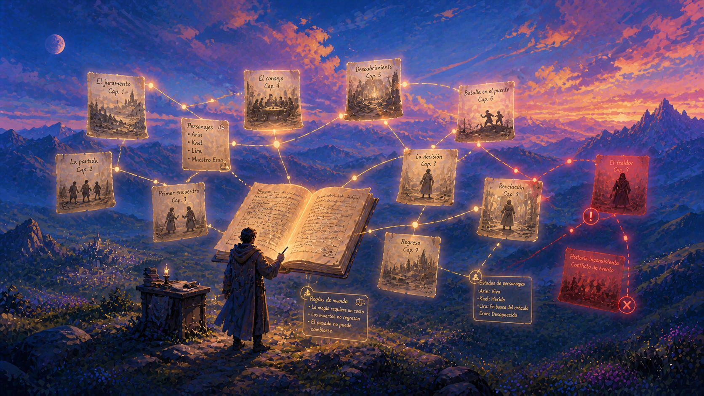

# Trama

> *Trama* en español tiene doble sentido: el argumento de la historia + el hilo transversal del tejido. Ambos hay que auditar para que la novela sostenga.

Auditor de continuidad para tu novela. Le apuntas al manuscrito y te responde preguntas sobre lo que ya escribiste, con **citas exactas** (capítulo, línea, texto verbatim).

---

## ¿Qué te ayuda a hacer?

- **Recordar todo lo que dijiste sobre un personaje, lugar u objeto** sin releer el manuscrito completo.
- **Detectar contradicciones**: ¿la edad de Marta cuadra entre los capítulos? ¿el color de ojos cambió? ¿la cronología es coherente con los saltos de tiempo?
- **Construir tu character bible automáticamente** a partir del texto: personajes, relaciones familiares, atributos detectados.
- **Encontrar hilos sin cerrar**: promesas que un personaje hizo y nunca cumplió, preguntas planteadas y nunca respondidas, objetos introducidos con énfasis que nunca volvieron a aparecer (Chekhov's gun sin disparar).
- **Mapear la línea temporal** del manuscrito y verificar que los saltos cuadren con la edad de los personajes y las estaciones.
- **Comparar versiones**: cada vez que terminás un capítulo, podés ver qué cambió desde la última auditoría — qué hilos nuevos abriste, cuáles cerraste.

Funciona con manuscritos en **español e inglés**. Soporta sagas multi-volumen y libros largos.

## ¿Qué NO hace?

- Escribir, generar, continuar o reescribir prosa
- Sugerir tramas, personajes o desarrollos
- Criticar la calidad de tu escritura
- Reemplazar a un editor humano de desarrollo

Es un **auditor literal**, no un colaborador creativo. Solo te dice lo que ya está en tu texto.

---

## Instalación

Trama funciona en **[Claude Code](https://claude.com/claude-code)** (CLI de Anthropic). Es la única manera de usarlo con todas sus capacidades.

```bash
mkdir -p ~/.claude/skills
git clone https://github.com/ChrisPiz/trama.git ~/.claude/skills/trama
```

Listo. La próxima vez que abras `claude` en una terminal, Trama está disponible. Mismo plan Pro/Max que ya pagás — sin costo extra.

> ⚠️ **Claude Desktop / Claude.ai web** funcionan en modo limitado (auditor one-shot, sin historial entre sesiones). Ver [DETAILS.md](DETAILS.md) para detalles.

---

## Cómo se usa

Una vez instalado, hablale a Claude Code en lenguaje natural:

```
Tú:    Audita /Users/yo/Documents/mi-novela.docx

Claude: ✓ Manuscrito listo: 87.432 palabras, 18 capítulos.
        ¿Qué quieres revisar?

Tú:    ¿Qué he dicho sobre Elena?

Claude: Sobre Elena: 7 menciones en 5 capítulos.

        Capítulo 1 — línea 5
        > Su madre Elena entró en la cocina sin tocar.

        Capítulo 4 — línea 230
        > Los ojos verdes de Elena la miraban con preocupación.

        [...]

Tú:    ¿La edad de Marta es consistente?

Claude: 🟡 edad de Marta — 3 afirmaciones, severidad=soft

        L23 · Capítulo 2: La carta
          [34] > Marta tenía 34 años cuando empezó todo.
        L1843 · Capítulo 5: La carta
          [36] > Marta tenía ahora 36 años.

        Δt narrativo entre citas: ~3 años. Diferencia de edad: 2 años.
        Posiblemente coherente, depende del salto narrativo.
```

Trama crea una carpeta `trama-doc/` **al lado de tu manuscrito** con todos los reportes, character bible, línea temporal, etc. Visible, abrible en Finder, versionable junto a tu libro.

---

## Más detalles

¿Querés saber cómo funciona por dentro, qué archivos crea, cómo correrlo en cron, o qué hace cuando el manuscrito tiene 500k palabras? → Ver [DETAILS.md](DETAILS.md).

---

## Licencia

MIT. Ver [LICENSE](LICENSE).
