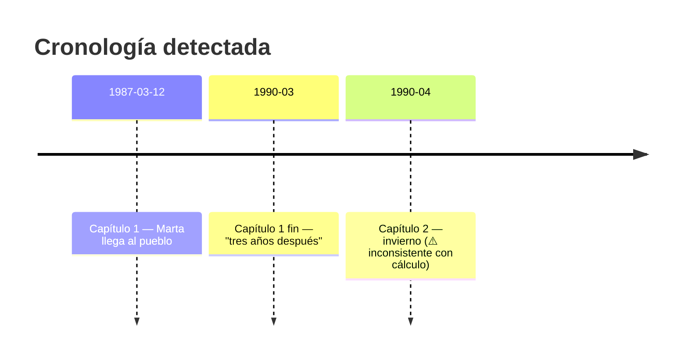

# Línea temporal

Extrae marcadores cronológicos del manuscrito y los mapea a una línea de tiempo aproximada para detectar saltos imposibles, contradicciones de duración, o estaciones inconsistentes.

## Tipos de marcadores

### Absolutos
- Fechas: `12 de marzo de 1987`, `March 12, 1987`, `12/3/87`
- Años solos: `en 1987`, `in 1987`
- Estaciones: `era invierno`, `that summer`
- Edades: `cuando tenía X años`

### Relativos
- Saltos: `tres años después`, `two months later`, `al día siguiente`, `the next morning`
- Duraciones: `durante una semana`, `for three days`
- Días de la semana: `el lunes`, `that Monday`
- Frecuencias: `cada mañana`, `every Sunday`

### Implícitos (más débiles)
- Climatológicos: `nevaba`, `el calor del verano`, `the autumn leaves`
- Festividades: `Navidad`, `Easter`
- Eventos históricos referenciados

Patrones regex completos en `references/patterns-bilingual.md`.

## Salida: `timeline.tsv`

```
line	chapter	type	marker	context
12	Cap 1	absolute	12 de marzo de 1987	"Llovía aquel 12 de marzo de 1987 cuando..."
245	Cap 1	relative	tres años después	"Tres años después, Marta volvió al pueblo."
1843	Cap 2	absolute	era invierno	"Era invierno y el silencio..."
2103	Cap 2	relative	al día siguiente	"Al día siguiente despertó tarde."
3502	Cap 3	absolute	cuando tenía 12 años	"Cuando tenía 12 años, su madre le contó..."
```

## Construcción de cronología

A partir del TSV, construye una cronología relativa anclada al primer marcador absoluto que encuentres. Asigna un timestamp aproximado (en días desde el ancla) a cada evento subsiguiente sumando/restando saltos relativos.

```
Ancla:    Cap 1 L12   → t=0   (12 marzo 1987)
Cap 1 L245   "tres años después" → t=+1095
Cap 2 L1843  "era invierno" → estación: invierno  (verifica: 1095 días desde marzo = ~marzo +3 años. Marzo no es invierno en hemisferio norte → ⚠️ revisar)
Cap 2 L2103  "al día siguiente" → t=+1096
```

**Conflictos detectables:**
- Estación inconsistente con cálculo de días
- Personaje con edad X en t=0, edad Y en t=Δ — verificar Y - X = Δ años
- Día de la semana citado vs cálculo desde fecha absoluta
- Saltos contradictorios ("tres años después" + "al día siguiente" en escenas adyacentes que parecen contiguas)

## Modos de operación

### Modo 1: Extracción simple
```bash
bash scripts/extract-timeline.sh "$WORK"
```
Produce `timeline.tsv`. Usuario lo revisa visualmente.

### Modo 2: Auditoría cronológica
Tras extracción, agrega flags de inconsistencia:

```
line	chapter	type	marker	context	flag
2103	Cap 2	relative	al día siguiente	"..."	⚠️ contradicción con "tres años después" en Cap 1 L245
```

El script `extract-timeline.sh --audit` activa este modo. Imprime `timeline-audit.tsv` con la columna extra.

### Modo 3: Diagrama (opcional)
Si el usuario pide visualización, genera Mermaid:



Guarda en `$WORK/timeline.md`. El escritor abre y revisa.

## Edge cases

- **Tiempos verbales narrativos**: "Había llovido toda la semana" — pasado perfecto que sugiere duración previa al momento narrado. El extractor lo captura como tipo `relative-prior`.
- **Flashbacks**: marcadores como "años atrás", "cuando era niña" pueden saltar la cronología hacia atrás. El audit los marca como `flashback` y no los suma a la línea principal.
- **Tiempo onírico/metafórico**: "tardó una eternidad", "pareció una hora" — el extractor los reconoce como hiperbólicos y los excluye del cálculo. Los reporta aparte para que el escritor decida.
- **Calendarios alternativos**: si la novela es fantasía con calendario propio ("año 832 de la Sexta Era"), el extractor los detecta como absolutos pero no puede validar estaciones. Avisa al usuario que hará validación interna (consistencia entre marcadores) sin anclaje al calendario gregoriano.

## Limitaciones

- Sin compresión semántica del texto, "después" sin cuantificador queda ambiguo. El extractor lo marca como `relative-vague` y no lo usa en cálculos.
- Saltos múltiples en cadena ("dos meses después, una semana más tarde, esa misma tarde") aumentan el error acumulado. Reporta intervalo de confianza, no fecha exacta.
- Si la novela usa narrador no fiable o tiempo subjetivo deliberadamente, marca cualquier reporte de inconsistencia con disclaimer: "Esto puede ser intencional dado el narrador."
